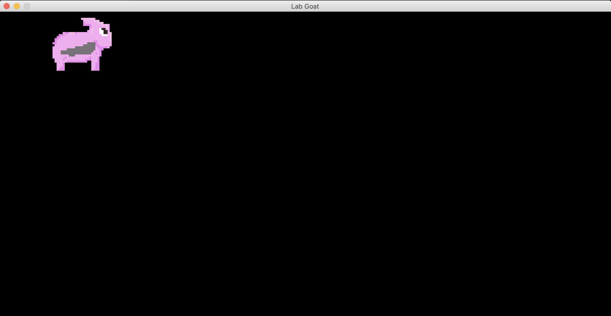
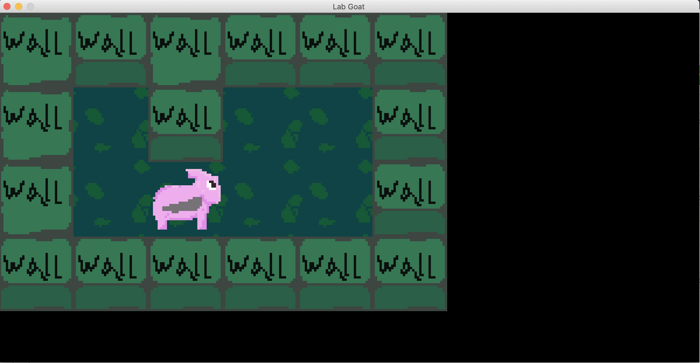
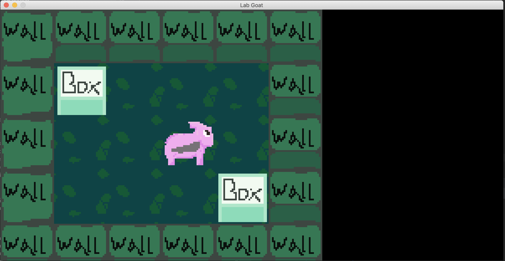
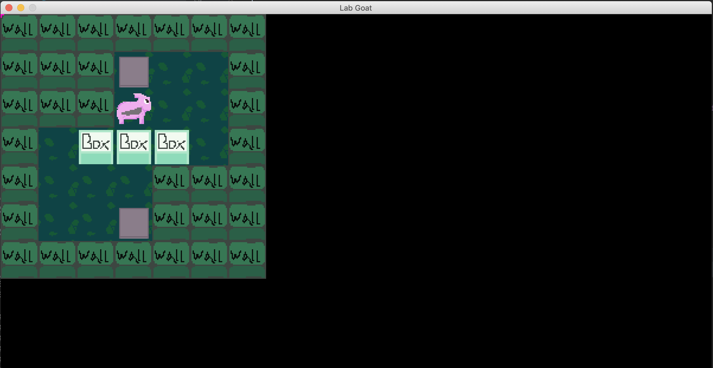
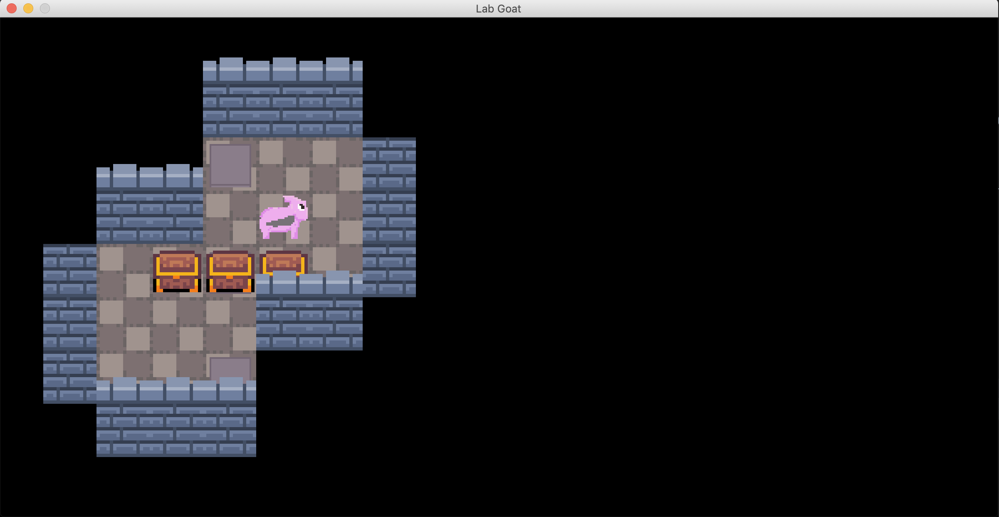

# `Lab Goat`
A small game about pushing boxes onto pressure plates to escape

## Game Play
You must push all boxes onto their targets,
so the door will open to advance to the next level.

## Controls
A = Up   
S = Down   
A = Left   
D = Right    
SPACE = Restart    
Enter = Okay    

## Tiles
* water?
* Lauchers?
    * send the box and you in a random direction
* TNT?
* Portals?
* Void?

## Features
* Levels
* Basic Box physics
* Custom assets
* Saves
* Gson level
* Level editor
* Way to share levels
* Hidden gems to collect
    * To unlock hidden levels
    
## Story
* You're a drawf trying to get your gold?

## To Do
* Camera tracking?
* Better textures
* Better level saves locations
* smoother location change animation
* Level editor
* Particles
* Saving mechs
* Maybe a solver?

## resources
*  http://weetu.net/Timo-Virkkala-Solving-Sokoban-Masters-Thesis.pdf

## Versions
### v0.2
We have assets loading from pngs and tiled printing to the screen.

### v0.3
We have objects that we can now collide with!

### v0.4
We can now push boxes

### v0.5
* Presure plates
* Level selection Menu
* Level serialization
* A few levels

### v0.6
* Imrpove the graphics a little
* Remove pink blob on top left corner

